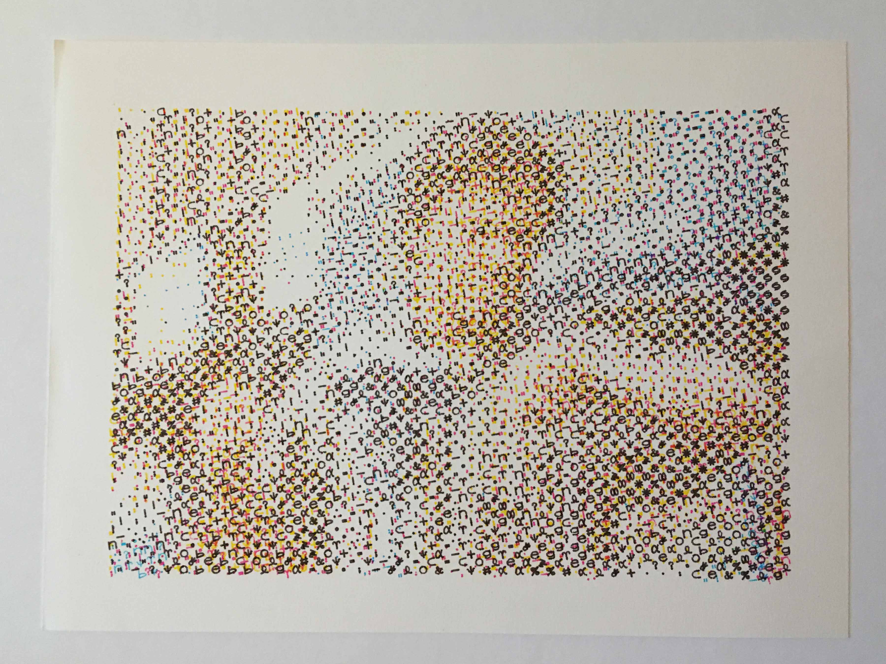

# Halftone

 

Playing around with halftoning. See more results at: https://thibautvoirand.com/halftone/

**Halftone theory**

[Halftoning](https://en.wikipedia.org/wiki/Halftone) is a reprographic technique that simulates continuous-tone image through the use of dots, varying in size or spacing, thus generating a gradient-like effect.

This reproduction relies on a basic optical illusion: since the halftone dots are small, the human eye interprets variations in dot size as variations in tone, even though a single ink color is used.

By repeating the halftone process for each subtractive color, commonly using the CMYK color model, the illusion of full-color imagery can be created using only four different inks.

In traditional photographic halftoning, continuous-tones were broken down into discrete points using a coarse-woven fabric "screen" suspended in front of the camera's photographic plate.

I thought that this concept would be interesting for a mechanical plotter. Indeed, in traditional or digital halftoning the entire screen is processed simultaneously, whereas a mechanical plotter makes it possible to "draw" every single dot of the screen using pen and paper.

**Plotting halftones**

I implemented [some code]([https://github.com/tvoirand/halftone](https://github.com/tvoirand/halftone) to draw halftone versions of digital images using a mechanical plotter. The method is described in the 3 following steps:

*Converting from RGB to CMYK*

First, a simple formula is used to convert the image from RGB (red, green, blue) to CMYK (cyan, magenta, yellow, black) color space. Then, the screens corresponding to each color are processed successively.

*Defining screens*

The position of all dots composing the screen are computed. These depend on the image dimensions as well as the desired screen resolution (the distance bewteen the centers of each dot) and orientation. Indeed, halftoning screens are commonly rotated in relation to each other to avoid unwanted visual effects such as [moiré patterns](https://en.wikipedia.org/wiki/Moir%C3%A9_pattern).

*Drawing dots*

In halftoning, the screen resolution is coarser than the input image resolution. Thus, each dot of the screen covers an area including several pixels of the image. The color intensity associated with each dot is computed by averaging the values of the pixels it covers.

Finally, the shapes of the dots are drawn, or saved to a vector graphics file to be drawn later. To first test the process with simple shapes, I simply used circles of size proportional to the dot's color intensity. Later I used more complex shapes as described below.

**Artistic screening**

[Artistic screening](https://www.researchgate.net/publication/37443249_Artistic_Screening) is a reprographic technique proposed by Ostromoukhov and Hersch (1995), where halftones are generated using screen elements which can take any desired shape instead of using the traditional round, elliptical, or square dots. With this approach, both the image to be reproduced and the screen elements can be designed independently, or have a specifical relation. The image can convey its message on different levels, or even different messages, when observed at different scales.

In the method proposed by Ostromoukhov and Hersch, variations of the dots' shapes are associated with color intensity levels by interpolating between fix predefined dot contours. I didn't go into this level of complexity, but decided to simply discretize color intensity levels and associate each level to a single shape.

**Combining halftone with glyphs**

For the shapes themselves, I chose to use "glyphs" extracted from the Hershey fonts, which are single line fonts particularly suited for the mechanical plotter. The selection and mapping of the glyphs to color intensity levels is performed in another project called [glyphtone](https://github.com/tvoirand/glyphtone).

Pushing the halftone method described above a little further by using glyphs instead of simple circles gave more interesting results. The concept of multi-scale approach proposed by Ostromoukhov and Hersch in their artistic screening method can be used, as in the [Kabuki actor](https://www.researchgate.net/figure/Kabuki-actor-by-Toshusai-Sharaku-Scene-inspired-from-the-Japanese-Kabuki-theater-The_fig2_37443249) piece by Toshusai Sharaku figured in their paper.
